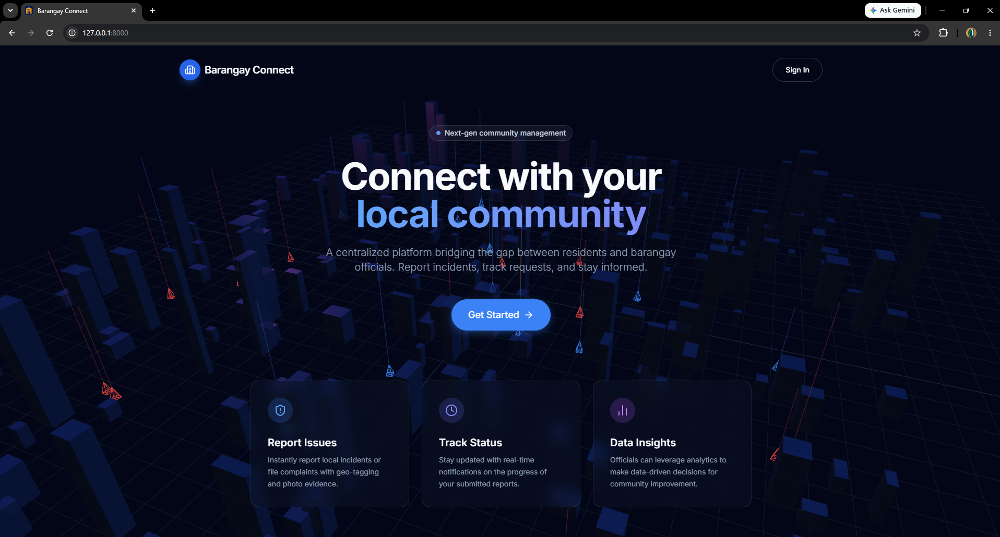
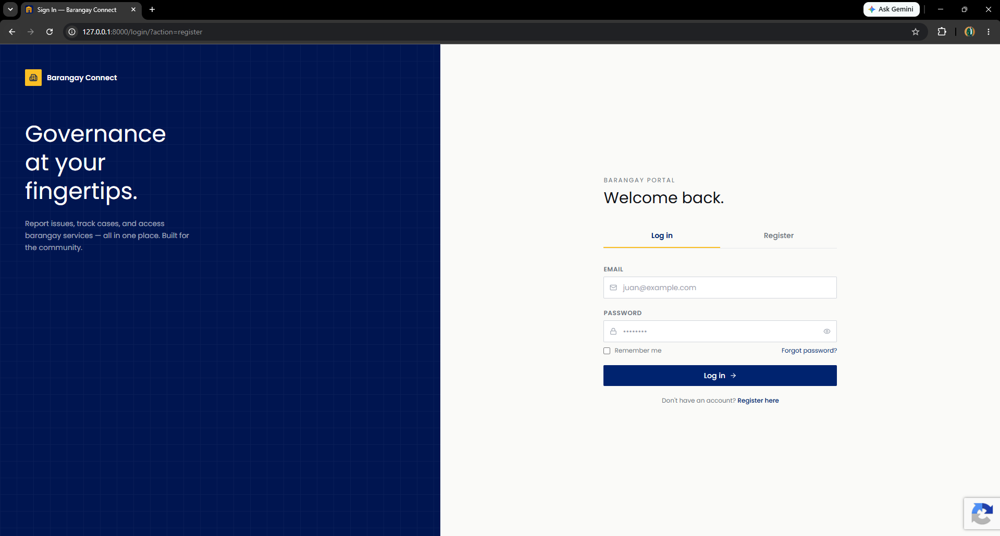
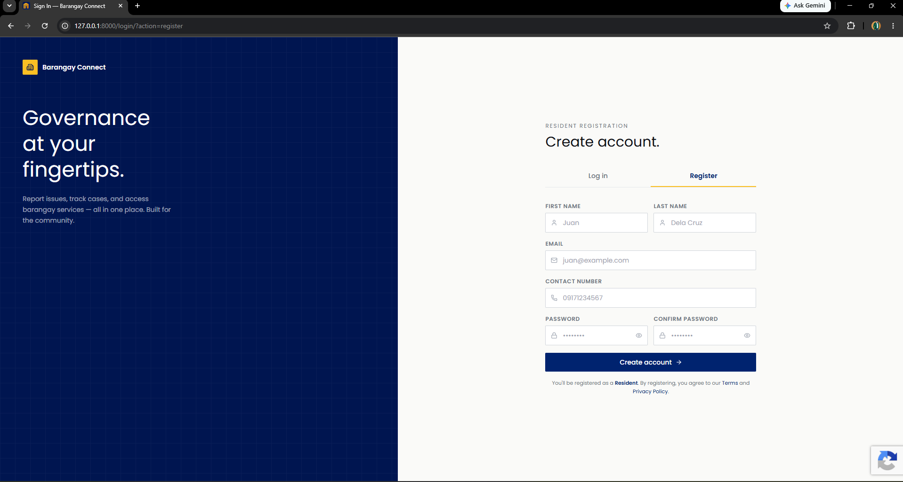
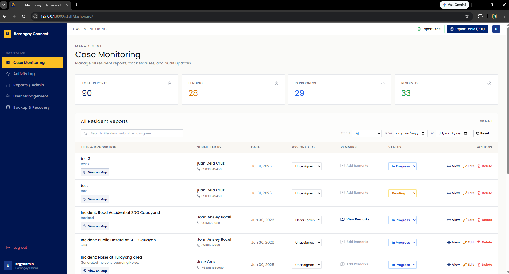
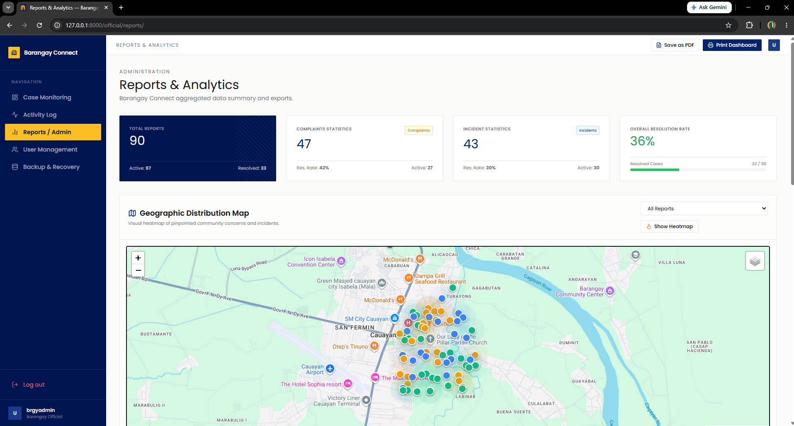
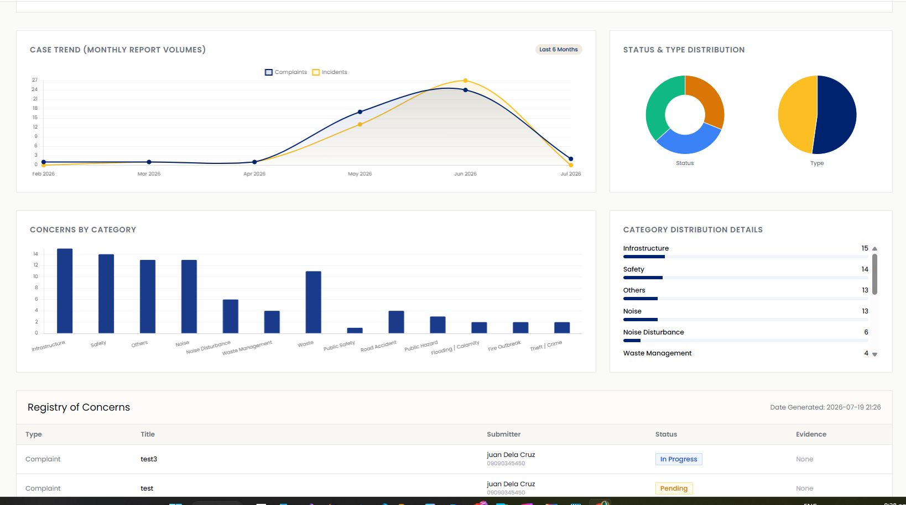
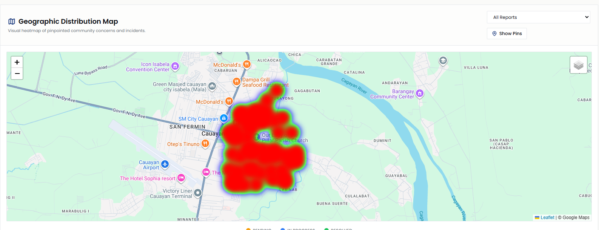
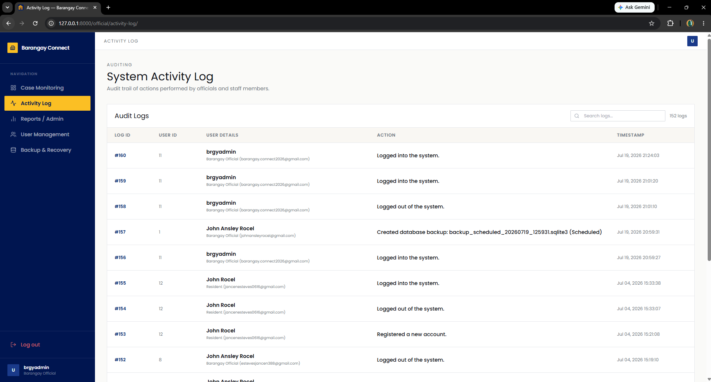
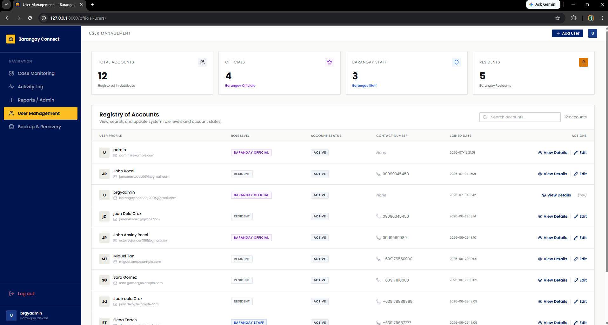
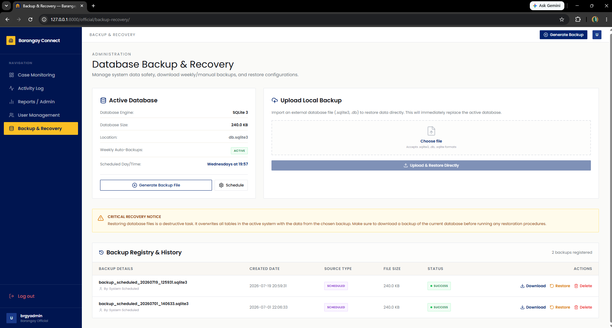

# Barangay Connect

Barangay Connect is a centralized report and incident management system designed to streamline communication and action between residents, barangay staff, and local officials.

---

## 📸 Screenshots & Previews

### Public Pages

  
   
  
  

### Official Dashboard

  
   
  
   
  
   
  
   
  
   
  
   
  

---

## ✨ Features

| Feature Category | Description | Access Level |
| :--- | :--- | :--- |
| **Interactive 3D Landing Page** | Premium, context-aware 3D city map with bouncing markers indicating active community concerns. | Public |
| **Case Monitoring System** | Centralized dashboard for staff and officials to track, assign, and update report statuses (Pending, In Progress, Resolved). | Staff, Official |
| **Geographic Heatmap** | Interactive Leaflet map displaying spatial density of incidents and complaints across the barangay. | Official |
| **Analytics & Data Insights** | Comprehensive visual charts (Chart.js) tracking case trends, resolution rates, and category distribution over time. | Official |
| **Resident Dashboard** | A personalized dashboard for residents to view their submitted reports and track status updates. | Resident |
| **System Activity Log** | Detailed audit trail recording user logins, logouts, report updates, and administrative changes. | Official |
| **User Management** | Registry for viewing and managing accounts across all role levels (Residents, Staff, Officials). | Official |
| **Database Backup & Recovery** | Built-in functionality for administrators to generate, download, and restore local SQLite backups. | Official |

---

## 🔒 Security Measures

| Security Feature | Implementation Details |
| :--- | :--- |
| **Role-Based Access Control (RBAC)** | Strict decorators and properties (`is_resident`, `is_staff`, `is_official`) to restrict view and API access based on user role. |
| **Authentication & Sessions** | Secure Django session-based authentication managing user logins and logouts. |
| **Form Protection (CSRF)** | Cross-Site Request Forgery (CSRF) tokens implemented on all state-changing forms and requests. |
| **Data Auditing** | `ActivityLog` tracking system ensures accountability for data modifications and user actions. |
| **Safe File Operations** | Built-in database backup system with strict directory validation and file format checking (.sqlite3). |
| **Content Security** | Proper template escaping to prevent Cross-Site Scripting (XSS) vulnerabilities. |

---

## 👥 Users & Stakeholders

Based on the system design requirements, the platform supports three primary user types, as well as indirect stakeholders:

### User Type 1: Resident
* **Role**: Submit complaints and incident reports; track complaint status.
* **Needs**: Easy reporting process, fast response times, real-time updates.
* **Access Privileges**: Submit new reports, view personal dashboard.

### User Type 2: Barangay Staff
* **Role**: Review complaints, verify information, update case status.
* **Needs**: Organized records, efficient workflows.
* **Access Privileges**: Manage complaints registry, update progress records.

### User Type 3: Barangay Administrator/Officials
* **Role**: Oversee operations, assign cases, make data-driven decisions.
* **Needs**: Accurate reports, reliable analytics tools.
* **Access Privileges**: Full system access, staff assignment, analytics dashboard, system backup.

---

## 🛠️ Tech Stack & Codebase Mapping
* **Framework:** Django (Python)
* **Database:** SQLite
* **Frontend:** Tailwind CSS, HTML5, Vanilla JavaScript, Lucide Icons, Three.js
* **Mapping & Analytics:** Leaflet.js, Chart.js

The stakeholders map directly to the application:
1. **User Roles:** Handled by `Profile.role` (`resident`, `staff`, `official`).
2. **Reports:** Managed through the `Report` model (`complaint`, `incident`).
3. **Analytics:** Gathered in `views.py` and displayed via Chart.js on `official_reports.html`.
